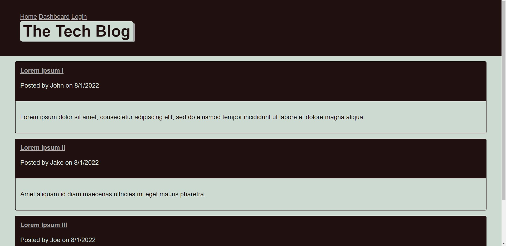

# Tech-Blog

## Deployed 

<a href="https://columbia-tech-blog.herokuapp.com/">Tech Blog</a>

A CMS-style blog site similar to a Wordpress site, where developers can publish their blog posts and comment on other developers’ posts as well. This incorporates an SQL database and filler information to show how the comments and posts would look if it were to be a live website. 